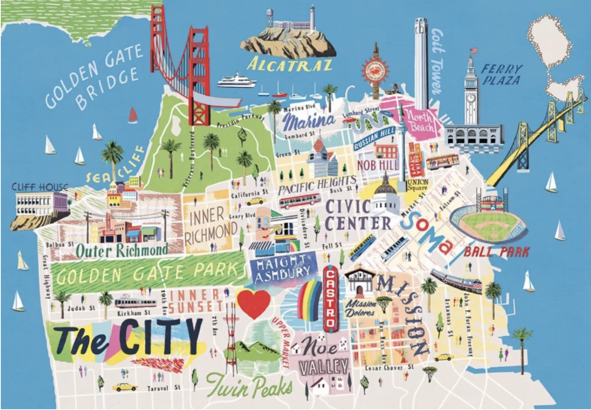
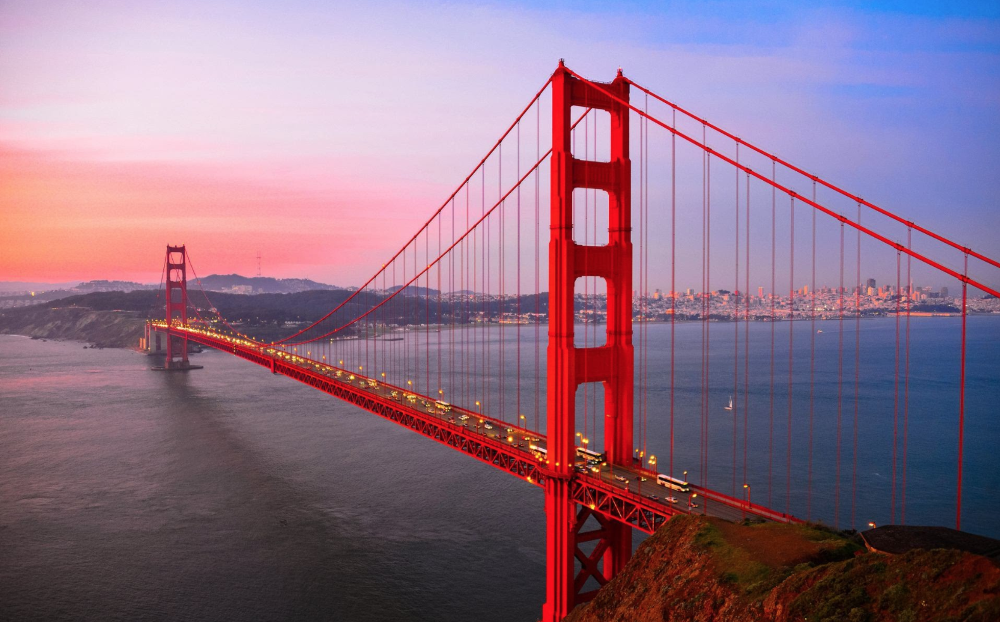
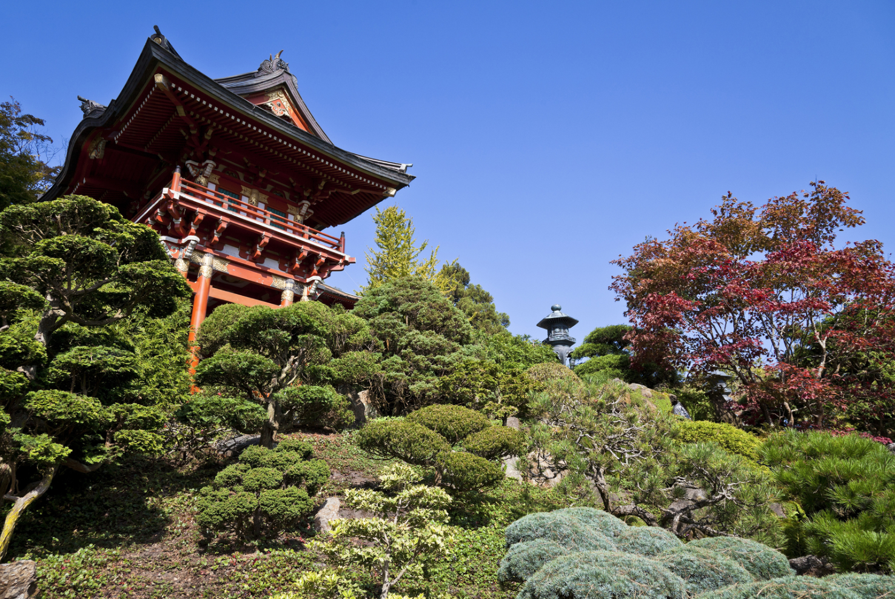
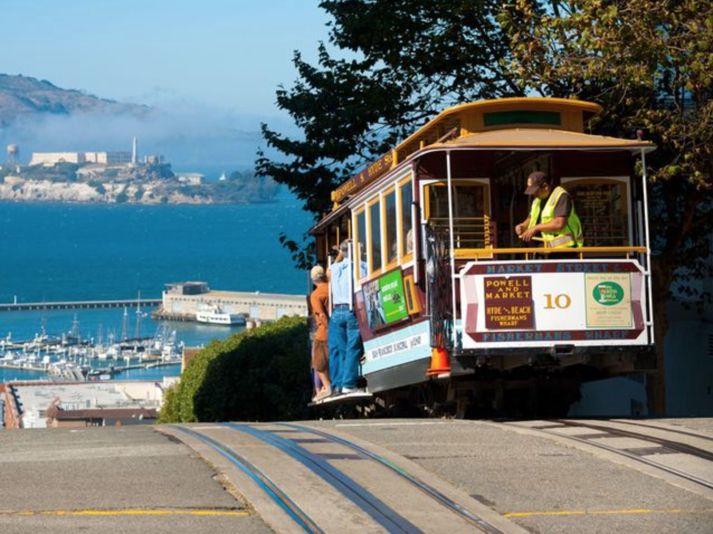
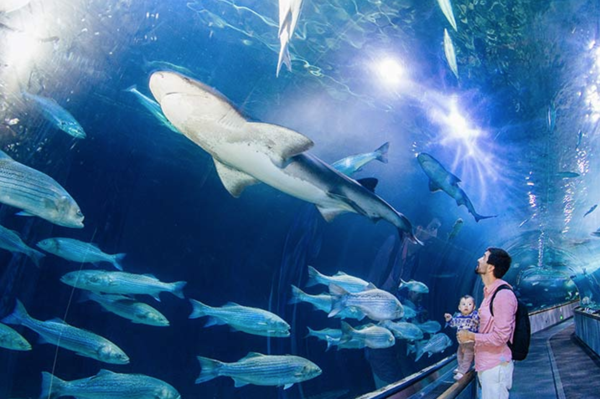
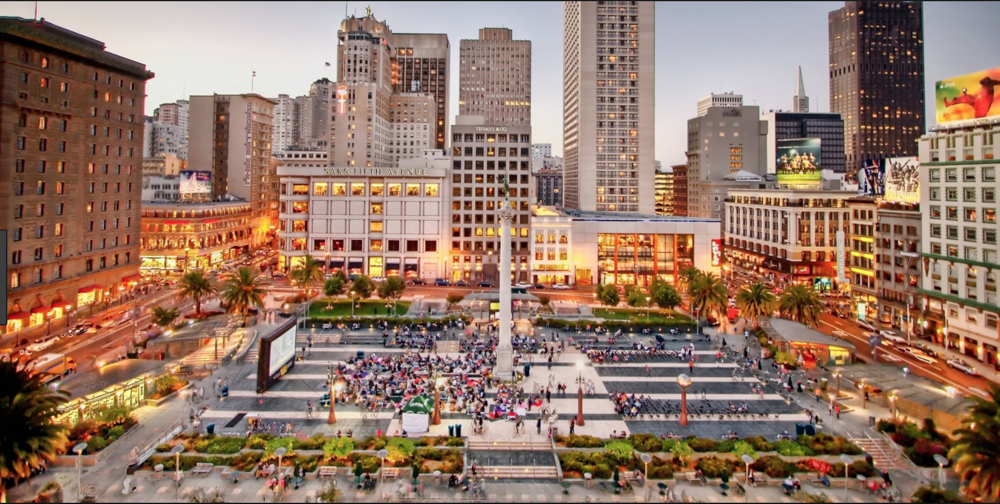
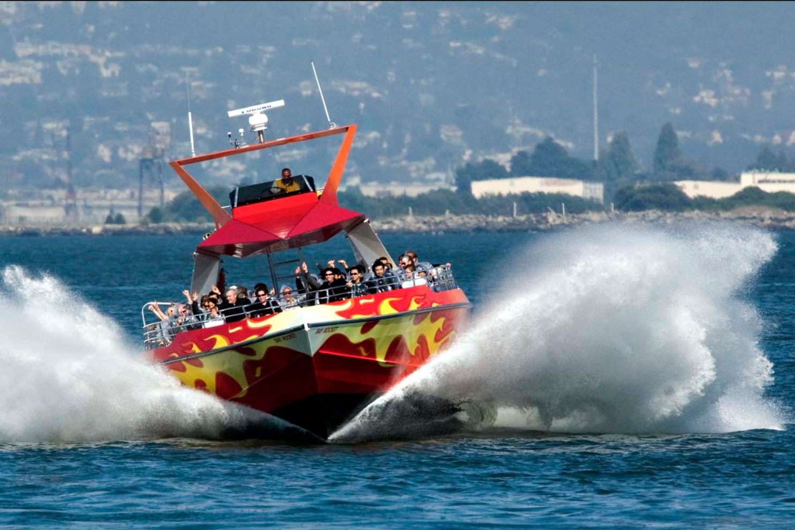
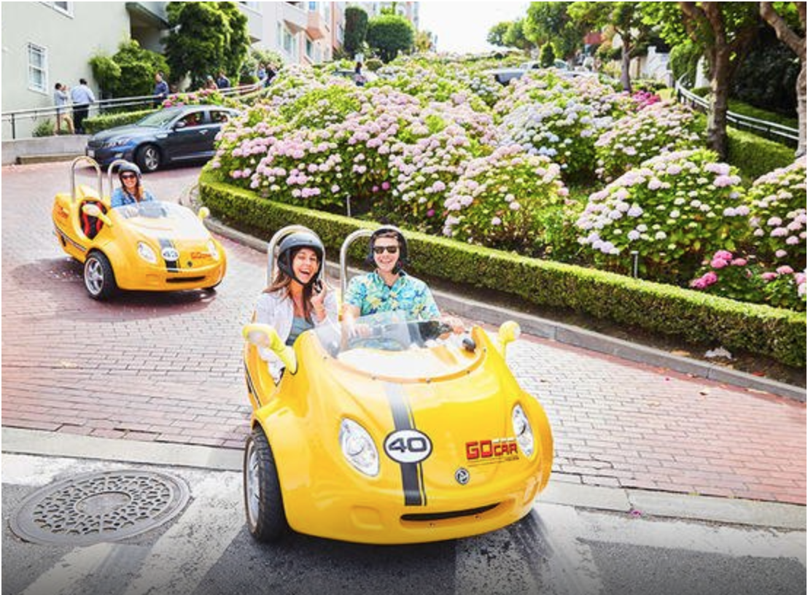
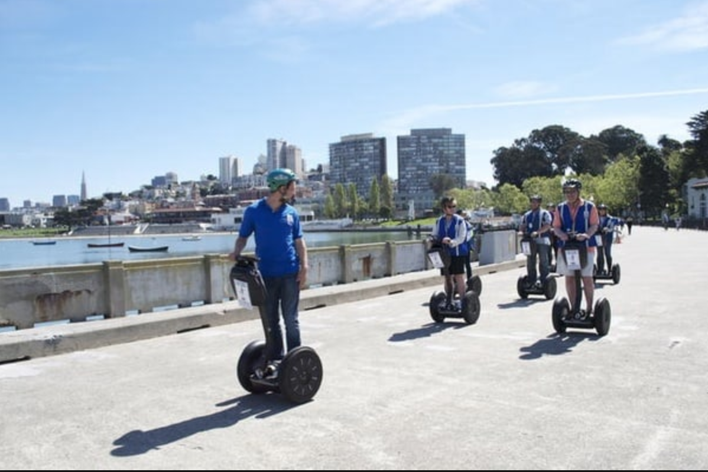

## Things to do in SFO

### Popular destinations
* Golden Gate Bridge
* Golden Gate Park
* Cabel Car
* Aquariam of the bay
* Union Square
* Rocket boat
* Sightseeing around the city

### Golden Gate Bridge
- Stroll across the bridge and stare at the water and boats.

### Golden Gate Park
- Big park with botanical garden, Japanese tea garden, and place to boat. Don't come here at night. Homeless people live here at night.

### Cable Car
- Ride down the hill and watch the view. It's like roller coaster, except it doesn't go very fast.

### Aquariam of the bar
- It's like you're living in the ocean!

### Union Square
- Place to shop lots of clothes.

### Rocket Boat
- Get to go on a really fast boat for 30 minutes, and stare at other boats.

### Sightseeing
- I remember you saying sightseeing's boring. But there are ways to make it fun by driving a mini-car or go on a segway city tour.

### Places to avoid 
